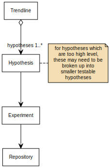

# emtech-process

Documentation on the process the EmTech team follows to test a hypothesis, experiment, and publish.

## Research and Engineering

We work iteratively, using Design Thinking to establish a hypothesis.

This hypothesis either relates to an established [trendline](https://www.avanade.com/en/thinking/research-and-insights/trendlines/emerging-technologies), partner, or technology release.

1. Once a hypothesis has been created, then we identify an experiment to test the hypothesis. The `template-artefacts` folder is used to start a private repository in GitHub.

2. The repository should be added to the [EmTech team](https://github.com/orgs/Avanade/teams/emtech) repositories list.

3. Information in the readme.md and hypothesis.md templates should be completed. These documents are not prescriptive.

4. The experiment and hypothesis should be completed.

5. The repository should follow the [Open Sourcing process](https://avanade.sharepoint.com/sites/GrowthOffice/SitePages/EmTech-Open-Sourcing.aspx) at this point.

   - If the project was client or partner funded, we will need their consent.
   - If the project used technology released under NDA (for example, private prevoews), then we will either need consent from the relevant product owner, or need to embargo the repository until the technology is published publicly.
   - If the project used information released under NDA, then we will either need consent from the party providing information, or will need to see if the project can be re-worked using informaiton that is freely available.

6. Once the open sourcing process is complete, the repository can be made public.

## Trendlines Hierachy

## Standards

All code is provided without warranty, and with documentation/support on a best endeavours basis only, unless otherwise stated.

### Folder structure

Using a prescriptive format based on the information [provided by Kriasoft](https://github.com/KriaSoft/Folder-Structure-Conventions) under the MIT license.

#### Typical layout

    .
    ├── src                     # Source files
    ├── dist                    # Compiled files (where provided)
    ├── docs                    # Documentation files and design artefacts (where needed)
    ├── test                    # Automated tests (where created)
    ├── tools                   # Tools and utilities (where provided)
    ├── LICENSE
    ├── LICENSE-EXCLUSIONS
    ├── full-licence
    ├── hypothesis.md
    └── README.md

## Open Sourcing

See [the intranet page](https://avanade.sharepoint.com/sites/GrowthOffice/SitePages/EmTech-Open-Sourcing.aspx) for full details on the open sourcing process to follow.

Track open sourcing status in [the GitHub project](https://github.com/orgs/Avanade/projects/1).
